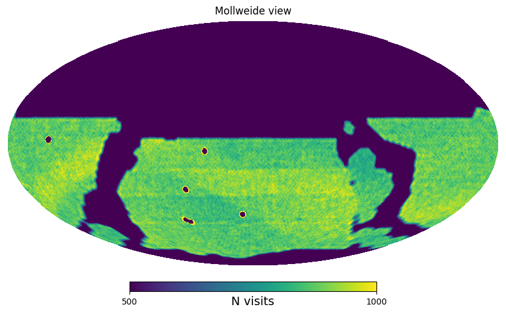

Getting started
===============

First import the module

.. code-block:: python

    import opsimsummaryv2 as opsim

Then load an OpSim output database using the `OpSimSurvey` class:

.. code-block:: python

    OpSimSurv = opsim.OpSimSurvey('baseline_v3.4_10yrs.db')

Compute healpy representation of the survey:

.. code-block:: python

    # Compute the healpy representation of the survey 
    # with a cut to a minimum of 500 and a maximum of 10000 visits
    OpSimSurv.compute_hp_rep(nside=256, minVisits=500, maxVisits=10000)

    # Plot the healpy configuration
    fig = OpSimSurv.plot_hp_rep(min=500, max=1000)

You can get the observations at any RA, Dec corrdinates using:

.. code-block:: python

    Obs = OpSimSurv.get_obs_from_coords(ra, dec, is_deg=False)

Note that `Obs` is a generator. One can obtain the list of observations by doing `Obs = list(Obs)`.

++++++++++++++++++++++
Writting a SIMLIB file
++++++++++++++++++++++

To write a SIMLIB you need to sample the survey:

.. code-block:: python

    # Sample the survey
    N_fields = 50000
    seed = 1234

    # Sample the suvey with 100 fields
    OpSimSurv.sample_survey(N_fields, random_seed=seed)

.. warning::

    An insufisant sampling will lead to a bad representaiton of the LSST survey. The default value used in the `make_simlib.py` 
    script is `N_fields=50000`

Then the SIMLIB can be write using the `SNANA_Simlib` class:

.. code-block:: python

    # Writing simlib
    sim = op.sim_io.SNANA_Simlib(OpSimSurv, out_path='./example_files/')
    sim.write_SIMLIB()

The `make_simlib.py` script available on the github repository is meant to help to create the LSST SNANA SIMLIB. It could be simply used:

.. code-block:: console

    $ python ../script/make_simlib.py -h

    usage: OpSimSummaryV2 script [-h] [--Nfields NFIELDS] [--host_file HOST_FILE]
                             [--hf_RA_col HF_RA_COL] [--hf_DEC_col HF_DEC_COL]
                             [--hf_radec_unit HF_RADEC_UNIT]
                             [--min_MJD MIN_MJD] [--max_MJD MAX_MJD]
                             [--output_dir OUTPUT_DIR]
                             [--random_seed RANDOM_SEED]
                             [--limit_numpy_threads LIMIT_NUMPY_THREADS]
                             [--n_cpu N_CPU]
                             db_file

    Execute OpSimSummaryV2 to create a SIMLIB from a OpSim output database.

    positional arguments:
    db_file               absolute path to the opsim database.

    optional arguments:
    -h, --help            show this help message and exit
    --Nfields NFIELDS, -Nf NFIELDS
                            Number of fields to sample
    --host_file HOST_FILE, -hf HOST_FILE
                            absolute path to a host file.
    --hf_RA_col HF_RA_COL, -hfra HF_RA_COL
                            RA column keys in host file
    --hf_DEC_col HF_DEC_COL, -hfdec HF_DEC_COL
                            DEC column keys in host file
    --hf_radec_unit HF_RADEC_UNIT
                            DEC column keys in host file
    --min_MJD MIN_MJD     Minimum date to query
    --max_MJD MAX_MJD     Maximum date to query
    --output_dir OUTPUT_DIR
                            Output dir or file for the SIMLIB
    --random_seed RANDOM_SEED, -rs RANDOM_SEED
                            Random seed for survey sampling
    --limit_numpy_threads LIMIT_NUMPY_THREADS, -np_threads LIMIT_NUMPY_THREADS
                            Limit the number of threads numpy could use.
    --n_cpu N_CPU         Number of cpu to use for matching survey and hosts.

