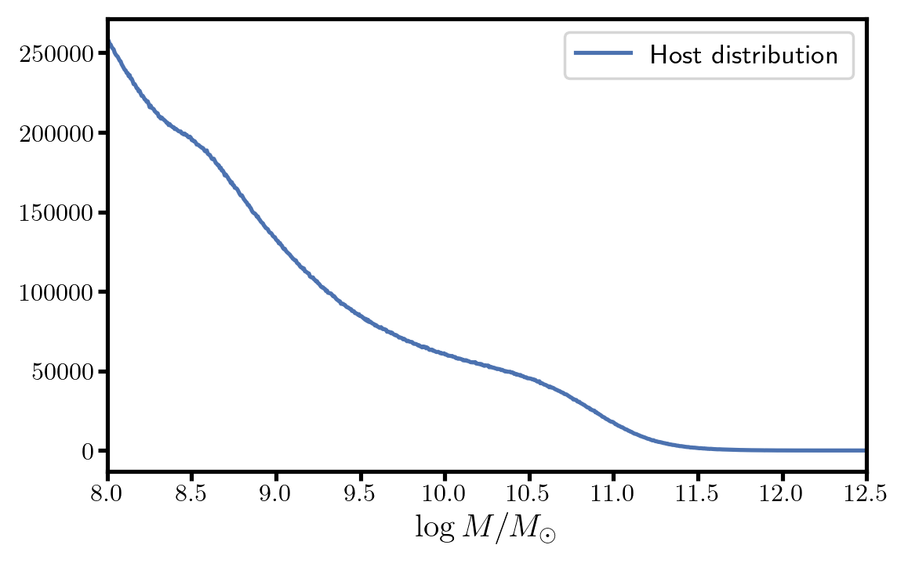
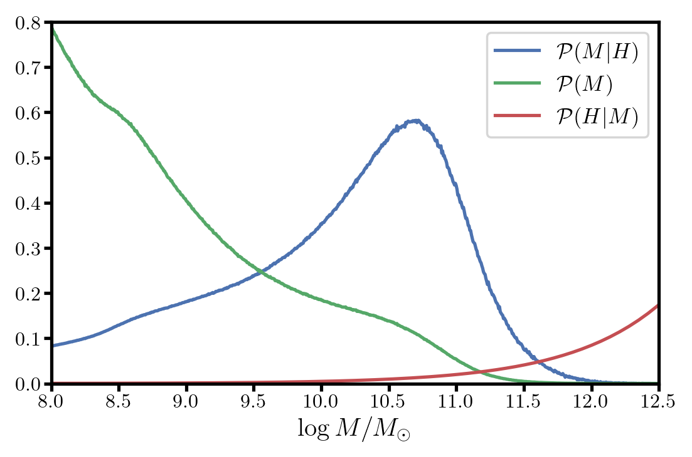

Notes on Host matching
=======================

Finding host around pointing
----------------------------

Host are matched to a pointing if they have an angular separation of less than the LSST fied radius (:math:`\Theta_\mathrm{Rubin} =` 1.75 deg).
Mathematically we can write, for a host of angular coordinates (RA, Dec) = :math:`(\theta,\phi)` at an angular separation :math:`\Theta_\mathrm{Rubin}` from the field
of angular coordinates :math:`(\theta_f,\phi_f)`

.. math::
    \cos\Theta_\mathrm{Rubin} = \sin\phi_f \sin\phi + \cos\theta_f\cos\theta \cos\left(\theta - \theta_f\right).

At second order (first order is null) this expression can be write

.. math::
    1 = \frac{\Delta\phi^2}{\Theta_\mathrm{Rubin}^2} + \frac{\Delta\theta^2}{\Theta_\mathrm{Rubin}^2}\frac{1 + \cos2\theta_f}{2}

where :math:`\Delta\phi = \phi - \phi_f` and :math:`\Delta\theta = \theta - \theta_f`. It corresponds to an ellipse where the axes along the RA angle is changing
with Dec angle. All host that are lying inside this ellipse are matched with the corresponding field.

Applying a SNANA WGT MAP
-------------------------

Host catalog can be huge and over-use memory when openned in a code. For example, a Uchuu mock up to a redshift :math:`z \sim 0.17` contains more than 10 milions 
hosts. However, their mass distribution doesn't match the one of SN Ia hosts. As we can see on Fig 1, there is a lot of small masses host that have few probability to be
a SN Ia host. 

    *Figure 1:* Distribution of host masses in an example Uchuu mock. 

If we define :math:`H` the event *beeing a SN Ia host*, the target distribution that we want to match is the mass distribution among SN Ia host :math:`\mathcal{P}(M | H)` that can be written

.. math::
    \mathcal{P}(M | H) \propto \mathcal{P}(H | M) \mathcal{P}(M),

where :math:`\mathcal{P}(M)` is the distribution of mass in the host catalog and :math:`\mathcal{P}(H | M)` is given by the WGTMAP. We plot in Fig 2 
these 3 distributions for the WGTMAP of DES using the Wiseman 2021 distribution for SN Ia host masses.

    *Figure 2:* Distribution of host masses, probability of being a SN Ia host knowing the host mass and distribution of probability to be a SN Ia host. 